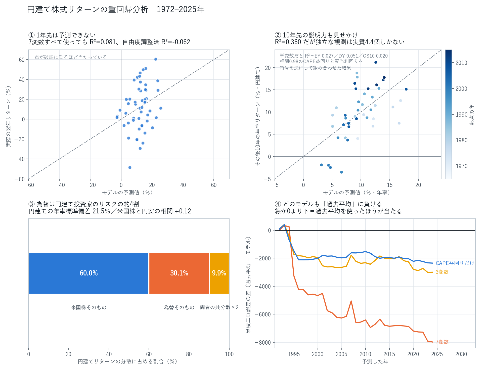

# 重回帰分析：円建てリターンは予測できるのか

このツールは予測モデルを持たず、実績データをブートストラップしている。
その設計判断が正しいかを確かめるために、「年末時点で分かっている情報から翌年のリターンを
説明できるか」を重回帰で検証した。**結論は、できない。**

```bash
pip install -r requirements.txt
python3 build_dataset.py   # データ統合（Shillerの元データは自動取得）
python3 regress.py         # 回帰（結果は report.txt）
python3 charts.py          # 作図（regression.png）
```



## データ

`../data/` の3系列（S&P500配当込み・MSCI World ex USA・ドル円年末）に加え、
[Shiller の長期データ](https://shillerdata.com/)から CAPE・配当利回り・米10年金利・CPI を取得。
元ファイル（1.6MB）は同梱せず `build_dataset.py` が取りに行き、使う年次系列だけを
`../data/shiller-annual-1871-2025.csv` に残す。標本は **1972〜2025年の54年**、欠測なし。

## 結果

### 1年先は予測できない

被説明変数は翌年の円建てS&P500リターン。説明変数は年末時点で観測できる7つ
（CAPE益回り・配当利回り・米10年金利・期間スプレッド・インフレ率・当年の為替変動・当年のリターン）。

| | 値 |
|---|---:|
| R² | 0.081 |
| **自由度調整済 R²** | **-0.062** |
| F検定 | p = 0.218 |
| 有意な変数 | **なし**（最小 p = 0.148） |
| 残差の標準偏差 | 23.3% |

自由度調整済R²が負ということは、**説明変数を7つ入れたモデルが、ただの平均値より説明していない**。
標準誤差はNewey-West（系列相関・不均一分散に頑健）。

### 10年先の説明力も見せかけ

CAPE益回り・配当利回り・米10年金利で10年先の年率リターンを説明すると R²=0.360 まで上がる。
だがこれは本物ではない：

- 単変数だと **R² は 0.002〜0.067** しかない（EY 0.027／DY 0.051／GS10 0.020）
- CAPE益回りと配当利回りの**相関は 0.978**。ほぼ同じものを測っている2変数が、
  符号を逆（-1.93 と +8.22）にして打ち消し合う形で入っている。VIFは21〜22
- 10年の重複標本なので、n=44 でも**独立な観測は実質4.4個**。Durbin-Watson=0.60

### 標本外では全部が「過去平均」に負ける

1992年以降を1年ずつ、それまでのデータだけで推定して予測した（Campbell-Thompson の標本外R²）。

| モデル | 標本外R² |
|---|---:|
| 全部入り（7変数） | **-0.458** |
| 絞り込み（3変数） | **-0.172** |
| CAPE益回りだけ | **-0.135** |

すべて負。**過去平均を使ったほうが当たる。**変数を増やすほど悪化するのは過剰適合の典型。

### 為替は円建て投資家のリスクの約4割

対数なら `ln(1+円建て) = ln(1+ドル建て) + ln(1+為替)` と厳密に分解できるので、分散も分解できる。

| 要因 | 分散に占める割合 |
|---|---:|
| 米国株そのもの | 60.0% |
| 為替そのもの | 30.1% |
| 両者の共分散×2 | 9.9% |

円建ての年率標準偏差は21.5%。米国株と円安の相関は+0.12でほぼ無相関、
つまり**為替は分散効果をほとんど生まないまま、リスクだけを上乗せしている**。

## この分析がツールに対して意味すること

予測モデルを載せなくて正解だった、ということ。年末の割安・割高も金利もインフレも、
翌年のリターンをまるで説明しない。**だからツールは予測せず、実際に起きた54年を引き直して
「幅」を見せている。**点推定を出さない設計自体が、この回帰結果の裏付けになっている。

一方で為替の分解は、円建てモードを既定にした判断を支持している。
円で投資する人にとって、リスクの4割は為替から来ている。
